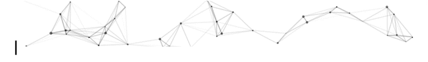

## About Me
- 
👨🏽‍💻 As a computer science graduate, I have a strong passion for software engineering, which I further developed through the rigorous ALX Software Engineering program. 
- 🏦 I'm currently applying my skills as an IT Application Support Officer at Tsehay Bank. 
- ⚡ I'm excited to continue developing my abilities in the tech industry and exploring new opportunities to grow. 
- 🎱 In my downtime, I love playing pool and reading books to unwind. 

- 👯 I'm interested in collaborating on Link Prediction algorithms, implementations, and Network analysis projects.

# 💻 Tech Stack:
                             

## 📊 GitHub Stats:
 
 

  
GitHub code metrics don't reflect my skill level or proficiency in a programming language. They only show the frequency of usage in my repositories.

## 🏆 GitHub Trophies

## Let's connect and engage ☕

  
  
  
  	  

## 🐦 Latest Tweet

## ✍️ Random Dev Quote

---

## Cool things I used to build this profile README

- TypeIt, Vue ParticleJS and Vue.js for the intro: https://codesandbox.io/s/readme-introgif-9fjo5/
- Tech Stack Icons from: https://img.shields.io/
- GitHub Stats and Trophies from: https://github-readme-stats.vercel.app, https://streak-stats.demolab.com/, https://github.com/anuraghazra/github-readme-stats, https://github-profile-trophy.vercel.app/
- Latest Tweet from: https://gtce.itsvg.in/
- Random Dev Quote from: https://quotes-github-readme.vercel.app
- Profile visit counter from: https://visitcount.itsvg.in/
